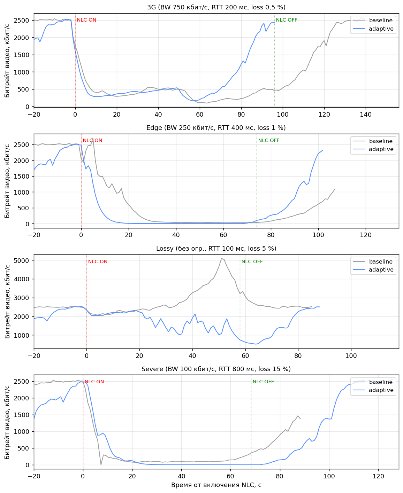
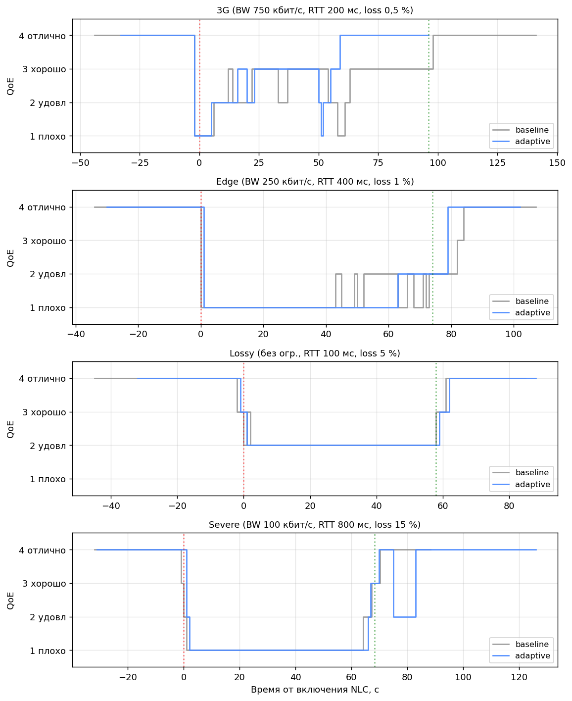
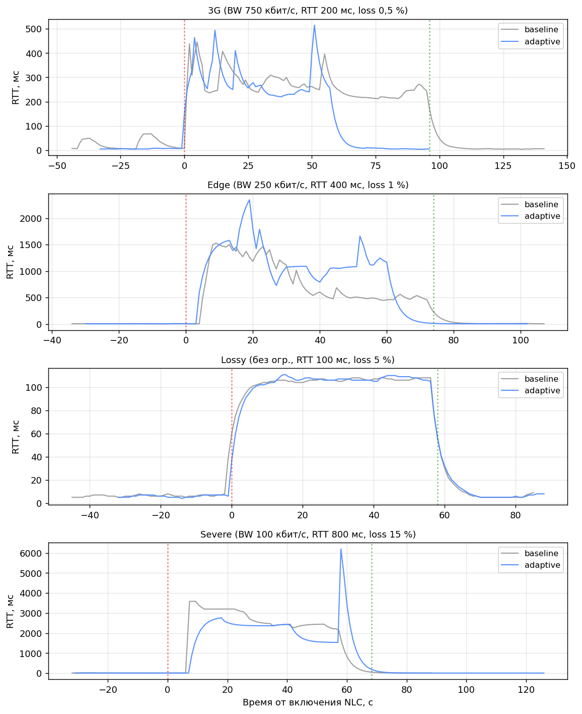

# 3 Программная реализация прототипа и экспериментальная оценка

В предыдущих разделах работы рассмотрены теоретические основы доставки
видеопотоков в браузерных WebRTC-соединениях и спроектирована
архитектура клиентского контроллера адаптации качества. Настоящий раздел
посвящён программной реализации спроектированного решения и
экспериментальной оценке его эффективности в сравнении со штатным
поведением WebRTC. Цель раздела — продемонстрировать применимость
предложенной архитектуры в виде работающего исследовательского прототипа
и количественно оценить эффект клиентского адаптивного слоя при
изменении сетевых условий.

Раздел организован следующим образом. В подразделе 3.1 описывается
программная реализация прототипа: структура проекта, серверный
сигналинг, клиентский baseline на основе AppRTC, авторский адаптивный
слой и пользовательский интерфейс наблюдаемости. В подразделе 3.2
формулируется методика эксперимента: используемые инструменты
эмуляции сетевых условий, набор сетевых профилей, процедура измерения и
подход к анализу полученных данных. В подразделе 3.3 представлены
результаты сравнительного эксперимента *baseline* и *adaptive* в
сформированных сетевых сценариях. В подразделе 3.4 обсуждаются
полученные результаты, обозначаются ограничения работы и направления
дальнейшего развития. Завершают раздел обобщающие выводы.

## 3.1 Программная реализация прототипа

Программная реализация прототипа выполнена на основе клиентских
компонентов проекта AppRTC (репозиторий `webrtc/apprtc`,
лицензия BSD 3-Clause), официально поддерживаемого сообществом
разработчиков WebRTC. AppRTC представляет собой эталонную реализацию
peer-to-peer видеосвязи в браузере, использующую стандартные
JavaScript-интерфейсы WebRTC. Использование AppRTC в качестве
baseline-реализации обеспечивает академическую корректность сравнения:
авторский адаптивный слой подключается поверх проверенной кодовой базы,
а различие в поведении системы между режимами *baseline* и *adaptive*
полностью обусловлено работой именно проектируемого клиентского
контроллера.

Серверная часть AppRTC (сигналинг-сервер Collider на языке Go и
backend на Google App Engine с Python) в прототипе не используется, так
как соответствующая инфраструктура устарела и не допускает развёртывания
на свободных хостинг-площадках. Вместо неё реализован минимальный
WebSocket-сигналинг на Node.js, функционально эквивалентный Collider в
части обмена SDP-описаниями сессии и ICE-кандидатами. Замена сигналинга
не затрагивает предмет исследования — клиентские механизмы адаптации
качества видеопотоков, — и обеспечивает воспроизводимость развёртывания.

### 3.1.1 Структура проекта

Прототип организован как самостоятельный программный комплекс
`apprtc-adaptive`, размещённый в публичном репозитории по адресу
`github.com/lananolana/apprtc-adaptive`. Общая структура проекта
представлена на рисунке 3.1.

```
apprtc-adaptive/
├── server/
│   └── signaling.js              # минимальный WebSocket-сигналинг
├── client/
│   ├── index.html                # точка входа клиента
│   ├── app.js                    # оркестрация WebRTC и адаптивного слоя
│   ├── ui/styles.css             # пользовательский интерфейс
│   ├── baseline/                 # компоненты на основе AppRTC (BSD 3-Clause)
│   │   ├── peerconnectionclient.original.js
│   │   └── sdputils.original.js
│   └── adaptive/                 # авторский клиентский адаптивный слой
│       ├── collector.js
│       ├── aggregator.js
│       ├── policy.js
│       ├── actuator.js
│       ├── recorder.js
│       └── dashboard.js
├── deploy/
│   ├── nginx.conf                # vhost для reverse-proxy + WS-upgrade
│   ├── post_deploy.sh            # скрипт после-деплойной настройки
│   └── setup.sh                  # одноразовая инициализация Linux VM
├── docs/                         # черновики глав ВКР
├── ecosystem.config.cjs          # конфигурация PM2 + автоматизация деплоя
├── package.json
├── README.md
└── LICENSE-APPRTC.md
```

Рисунок 3.1 — Структура программного проекта

Прототип разделён на серверную (`server/`) и клиентскую (`client/`)
части. Клиентская часть, в свою очередь, разделена на каталоги
`baseline/`, содержащий заимствованные модули AppRTC с сохранением
лицензионных заголовков BSD 3-Clause, и `adaptive/`, содержащий
авторский код проектируемого клиентского контроллера. Такое разделение
обеспечивает прозрачность атрибуции и упрощает анализ объёма и
характера вклада студента.

### 3.1.2 Серверный сигналинг

Серверная часть прототипа реализована в виде минимального
WebSocket-сигналинга на Node.js с использованием библиотеки `ws`.
Сигналинг-сервер выполняет три функции: предоставляет статическое
содержимое клиента (HTML, JS, CSS), поддерживает WebSocket-эндпоинт
`/ws` для обмена сигнальными сообщениями между клиентами и
обеспечивает healthcheck-эндпоинт `/healthz`, используемый системами
мониторинга развёртывания.

Сигнальный протокол реализует следующие типы сообщений:

- `join` — регистрация клиента в комнате; сервер отвечает сообщением
  `joined` с указанием роли (`caller` или `callee`);
- `peers` — оповещение об изменении количества участников в комнате;
- `offer`, `answer` — пересылка SDP-описаний сессии между участниками;
- `candidate` — пересылка ICE-кандидатов между участниками;
- `restart-request` — служебное сообщение от callee к caller для
  инициации перепогона ICE при разрыве соединения;
- `remote-constraint` — сообщение, которым каждый пир уведомляет
  собеседника о текущем уровне ступени качества для реализации
  кооперативной двусторонней адаптации;
- `bye` — оповещение о завершении сессии.

Каждая «комната» поддерживает не более двух одновременных соединений,
что соответствует области применения исследования (peer-to-peer
видеосвязь). При попытке третьего клиента подключиться к занятой
комнате сервер возвращает сообщение `full`.

### 3.1.3 Клиентский baseline на основе AppRTC

Базовая реализация WebRTC-клиента основана на архитектуре
`PeerConnectionClient` из проекта AppRTC. Из состава AppRTC заимствованы
два ключевых модуля: `peerconnectionclient.js` — обёртка над
`RTCPeerConnection`, реализующая управление SDP-описаниями, ICE-
кандидатами и состояниями соединения; `sdputils.js` — утилиты
манипуляции с SDP-описаниями для управления параметрами кодирования
и порядком кодеков. Оба модуля размещены в каталоге `client/baseline/`
с сохранением оригинальных лицензионных заголовков и без модификации
исходного кода.

В файле `client/app.js` реализована оркестрация peer-to-peer звонка с
использованием паттернов AppRTC: создание `RTCPeerConnection`, добавление
локальных медиатреков через `addTrack()`, обработка событий
`onicecandidate` и `ontrack`, реализация модели offer/answer для
согласования сессии. Источник медиаданных задаётся через стандартный
интерфейс `navigator.mediaDevices.getUserMedia()` с предпочтениями
1280 × 720 при 30 кадрах в секунду.

### 3.1.4 Авторский клиентский адаптивный слой

Клиентский адаптивный слой реализован как совокупность
JavaScript-модулей в каталоге `client/adaptive/`, точно соответствующих
архитектурной декомпозиции, представленной в подразделе 2.3
настоящей работы. Помимо четырёх основных модулей контура адаптации
качества (Collector, Aggregator, Policy, Actuator) реализованы модули
наблюдаемости (Dashboard, Recorder), модуль обнаружения подвисания
видео (FreezeDetector), модуль восстановления соединения
(RecoveryManager), а также служебные компоненты пользовательских
уведомлений (Toast, Overlays). Назначение каждого модуля рассмотрено
ниже.

**`collector.js`** реализует модуль периодического опроса состояния
WebRTC-соединения. Функция `startMetricsCollector(pc, onSample, opts)`
запускает таймер с заданным периодом (по умолчанию 1000 мс), при
срабатывании которого вызывается `pc.getStats()`, и полученный
`RTCStatsReport` обрабатывается для извлечения релевантных метрик.
Битрейт исходящих аудио- и видеопотоков вычисляется дифференцированием
кумулятивных значений `bytesSent` по времени относительно предыдущего
сэмпла. Результат передаётся в обратный вызов `onSample` в виде
объекта `RawSample` с унифицированным набором полей. Поля, недоступные
в текущем сэмпле или нестабильно обновляемые конкретной реализацией
браузера, возвращаются как `null`, что согласуется с требованием
ФТ-7.

**`aggregator.js`** реализует модуль агрегации сырых сэмплов и
формирования сглаженного представления состояния соединения. Класс
`Aggregator` поддерживает внутреннее состояние с экспоненциально
сглаженными значениями ключевых метрик. Коэффициент сглаживания
α = 0,3 — означает, что текущий сэмпл получает вес 30 %, а
накопленное состояние — 70 %. Относительные потери пакетов
вычисляются как отношение приращения `packetsLost` к суммарному
приращению `packetsLost + packetsReceived` между двумя
последовательными сэмплами. Интегральная оценка качества `qoeScore`
формируется по четырёхуровневой шкале, описанной в подразделе 1.3,
по принципу минимума: оценка снижается до уровня, соответствующего
худшему из показателей.

**`policy.js`** реализует политику принятия решений. Класс
`AdaptationPolicy` инкапсулирует ступенчатую шкалу качества из шести
уровней (от 180p@10 до 720p@30), а также параметры гистерезиса:
`hysteresisN = 3` — минимальное число подряд идущих «плохих» либо
«хороших» сэмплов для принятия решения о переключении; `cooldownMs =
5000` — минимальный временной интервал между двумя последовательными
переключениями. Метод `evaluate(stats)` возвращает либо `null` (нет
решения), либо объект `Decision` с указанием действия (`downgrade`,
`upgrade`, `audioOnly`, `restoreVideo`), целевой ступени и текстового
обоснования. Метод `setEnabled(boolean)` переводит политику между
режимами *baseline* (политика отключена, решения не принимаются) и
*adaptive* (политика активна).

**`actuator.js`** реализует модуль применения управляющих воздействий
к локальному медиа и к WebRTC-сендеру. Класс `Actuator` принимает в
конструкторе ссылку на `RTCPeerConnection` и поддерживает два
независимых значения уровня: `localLevel` (запрашиваемый локальной
политикой) и `remoteLevel` (сообщённый собеседником через сигнальное
сообщение `remote-constraint`). Метод `apply(decision)` обновляет
`localLevel` по результату работы локальной политики; метод
`setRemoteLevel(level)` обновляет `remoteLevel` по сообщению от
собеседника. Фактически применяемый к отправителю уровень
рассчитывается как `min(localLevel, remoteLevel)`, что реализует
кооперативную двустороннюю адаптацию, описанную в подразделе 2.4.4.
Все параметры кодирования — разрешение, частота кадров и битрейт —
устанавливаются единственным вызовом `RTCRtpSender.setParameters()`
через поля `encodings[0]`: `scaleResolutionDownBy` задаёт коэффициент
даунскейла относительно реального разрешения захвата (вычисляется из
`track.getSettings()`), `maxFramerate` ограничивает частоту кадров,
`maxBitrate` — пиковый битрейт. Метод `MediaStreamTrack.applyConstraints()` сознательно не
используется: его вызов приводит к переинициализации устройства
захвата, что вызывает кратковременное «мигание» видеоокна и индикатора
камеры. При многократных переходах между ступенями шкалы это
приводило бы к серии таких артефактов, что недопустимо. Использование
энкодера для даунскейла, напротив, не затрагивает камеру и
обеспечивает плавную смену качества. Для перехода в режим audio-only
видеотрек отключается через `track.enabled = false`, и дополнительно
вызывается `setParameters()` с `encodings[0].active = false`. Обратный
переход восстанавливает оба состояния и применяет нижнюю ступень
шкалы качества.

**`recorder.js`** реализует модуль записи телеметрии в CSV-файл,
используемый для воспроизводимых экспериментов. Класс `Recorder`
накапливает сэмплы в памяти в виде структурированных строк с
фиксированным набором столбцов (`ts_ms`, `mode`, `event`, `rttMs`,
`jitterMs`, `lossPct`, `videoKbps`, `audioKbps`, `fps`, `frameWidth`,
`frameHeight`, `framesDropped`, `qoeScore`, `adaptAction`, `adaptLevel`)
и по команде сохраняет содержимое в файл через стандартный
браузерный механизм `Blob` и `<a download>`. Дополнительные столбцы
`mode` и `event` позволяют размечать сегменты эксперимента (смена
сетевого профиля, переключение режима) внутри одной записи.

**`dashboard.js`** реализует отрисовку метрик и состояния адаптации в
реальном времени. Дашборд расположен в правой панели интерфейса
прототипа и обновляется на каждый сэмпл (1 Гц). Помимо численных
значений метрик отображаются текстовая интегральная оценка качества
(«отлично», «хорошо», «удовлетворительно», «плохо») и состояние
адаптации (последнее принятое решение политики с указанием действия,
целевой ступени и обоснования).

**`freeze-detector.js`** реализует детектор подвисания удалённого
видеопотока. Класс `FreezeDetector` отслеживает монотонный счётчик
`framesReceived` из записи `inbound-rtp` (раздел 1.3) и фиксирует
переход в состояние «зафризился», если счётчик не растёт дольше
заданного порога (по умолчанию 3 секунды). Этот сценарий характерен
для случаев потери ключевых кадров при сохранении других характеристик
канала и в практике видеосвязи проявляется как «голос идёт,
изображение замерло». Состояние выходит в callback только при смене
значения, что предотвращает дребезг.

**`recovery.js`** реализует менеджер восстановления соединения,
спроектированный в подразделе 2.4.4. Класс `RecoveryManager` принимает
ссылку на `RTCPeerConnection` и набор callback-ов для взаимодействия
с сигналингом и пользовательским интерфейсом. Метод `observe(stats)`
вызывается на каждом сэмпле основного цикла телеметрии и проверяет
три условия запуска восстановления (`iceConnectionState === 'failed'`,
длительное `disconnected`, отсутствие роста `bytesReceived` при
формально активном соединении). В случае срабатывания инициируется
ICE restart: на стороне *caller* — через создание нового offer с
флагом `iceRestart: true`, на стороне *callee* — через отправку
*caller* сигнального сообщения `restart-request`. После
`attemptTimeoutMs` миллисекунд проверяется результат и при
необходимости планируется следующая попытка; общее число попыток
ограничено `maxAttempts = 3`.

**`toast.js` и `overlays.js`** реализуют пользовательскую обратную
связь о состоянии соединения и принятых решениях контроллера.
`toast.js` представляет собой минимальную систему всплывающих
уведомлений в правом нижнем углу экрана с типами `info`, `success`,
`warn`, `error`. `overlays.js` управляет тремя экранными оверлеями
над удалённым видеопотоком: оверлеем audio-only режима (при переходе
политики в защитное состояние), оверлеем фриза (при срабатывании
FreezeDetector), оверлеем восстановления соединения (при работе
RecoveryManager). Оверлеи имеют приоритет recovery > frozen >
audio-only — отображается тот, чей приоритет выше. Бейдж качества
соединения в шапке интерфейса показывает интегральную оценку в
читаемой форме («Отличное / Хорошее / Среднее / Плохое соединение»),
а также особые состояния «Только аудио» и «Восстановление».

Все модули адаптивного слоя оформлены как ES-модули с явным экспортом
интерфейсов, что обеспечивает изолированное тестирование и упрощает
расширение системы (требование НФТ-5). Логика классов `Aggregator`,
`AdaptationPolicy`, `FreezeDetector`, `RecoveryManager` и `Recorder`
покрыта модульными тестами на встроенном механизме `node:test`;
серверный сигналинг покрыт интеграционным тестом, поднимающим
сервис на изолированном порту и проверяющим протокольный обмен.
Запуск всего тестового набора выполняется командой `npm test`.

### 3.1.5 Пользовательский интерфейс и обратная связь

Пользовательский интерфейс прототипа спроектирован в исследовательских
целях и обеспечивает следующие функциональные возможности:

- создание и присоединение к видеосессии по короткому идентификатору
  комнаты, передаваемому через URL-параметр;
- отображение локального и удалённого видеопотоков;
- переключение между режимами *baseline* и *adaptive* без прерывания
  сессии (требование ФТ-8);
- дашборд телеметрии с обновлением раз в секунду;
- управление записью эксперимента (старт, метка профиля, остановка с
  сохранением CSV);
- индикация состояния соединения и текущего режима;
- бейдж качества соединения в шапке («Отличное / Хорошее / Среднее /
  Плохое соединение», «Только аудио», «Восстановление»);
- три экранных оверлея над удалённым видеопотоком, отражающих
  состояние контроллера: переход в audio-only при экстремальной
  деградации, обнаружение подвисания видео, выполнение
  восстановления соединения;
- toast-уведомления о ключевых событиях: переключении режима,
  переходе в audio-only и восстановлении видео, обнаружении и снятии
  фриза, запуске и завершении восстановления соединения.

Реализация пользовательской обратной связи следует принципу
прозрачности адаптивной системы: каждое существенное решение
контроллера сопровождается видимым изменением интерфейса. Это
важно как с точки зрения исследовательского анализа поведения
системы (наблюдаемость в режиме реального времени), так и с точки
зрения практической применимости — пользователь информирован о
причине изменения качества и о действиях, предпринимаемых
контроллером для сохранения связи. В частности, ситуация «голос
идёт, картинка замерла», характерная для типовых сценариев
видеосвязи при кратковременных потерях ключевых кадров, в
прототипе обрабатывается осознанно: оверлей с пояснением «Сигнал
ослаб, восстанавливаем картинку…» заменяет застывший последний
кадр, что снижает воспринимаемую деградацию качества пользователем
без вмешательства в фактический процесс восстановления.

Внешний вид интерфейса представлен на рисунке 3.2. Дизайн ориентирован
на функциональность исследовательского прототипа, а не на
производственную эстетику.

```
+----------------------------------------------------------+
| WebRTC Adaptive | [ID комнаты]  [Войти/создать]          |
|                 | [Копировать ссылку] [Завершить]        |
|                 | (●) baseline ( ) adaptive              |
|                 | [profile input]  [Mark]  [● Запись]    |
+-------------------------+--------------------------------+
|                         |    ТЕЛЕМЕТРИЯ WEBRTC           |
|   [Локальный видеопоток]|    Состояние ICE:  connected   |
|                         |    Состояние PC:   connected   |
|                         |    RTT, мс:        45          |
+-------------------------+    Jitter, мс:     2.3         |
|                         |    Loss, %:        0.00        |
|   [Удалённый поток]     |    Video bitrate:  1450 кбит/с |
|                         |    Audio bitrate:  32 кбит/с   |
|                         |    FPS:            29          |
|                         |    Разрешение:     1280×720    |
|                         |    QoE score:      отлично (4) |
|                         |    Состояние адапт.: уровень 5 |
+-------------------------+--------------------------------+
| Готов к подключению.    | режим: adaptive                |
+----------------------------------------------------------+
```

Рисунок 3.2 — Схема интерфейса прототипа

Прототип развёрнут как публично доступное приложение по адресу
`https://webrtcvkr.nomorepartiessite.ru`. Развёртывание выполнено на
виртуальной машине Yandex Cloud (Ubuntu 22.04, IP 158.160.220.226)
с использованием менеджера процессов PM2, реверс-прокси Nginx и
TLS-сертификата Let's Encrypt. Конфигурация развёртывания включена в
репозиторий проекта (`deploy/`, `ecosystem.config.cjs`).

## 3.2 Методика эксперимента

Цель эксперимента — количественно оценить эффект работы предложенного
клиентского адаптивного слоя в условиях, имитирующих типовые сценарии
ухудшения сетевых условий, в сравнении со штатным режимом работы
WebRTC. Эксперимент построен как трёхуровневое исследование,
сочетающее контролируемые и натурные измерения:

- **Уровень A — контролируемые измерения с эмулятором сетевых
  условий.** Цель — обеспечить точную воспроизводимость и попарное
  сравнение режимов *baseline* и *adaptive* при идентичных сетевых
  параметрах. Базовая часть §3.3.1–3.3.4.
- **Уровень B — натурный сценарий потери связи на двух устройствах.**
  Цель — проверить менеджер восстановления соединения на реалистичном
  обрыве сети, а не на лабораторной имитации. Используется в §3.3.5.
- **Уровень C — полевой кейс реальной международной видеосвязи.**
  Цель — внешняя валидация работы прототипа в условиях, выходящих за
  рамки лаборатории. Используется в §3.4 как case study.

Такое распределение позволяет получить **внутреннюю достоверность**
(уровень A — статистически осмысленное попарное сравнение) одновременно
с **внешней достоверностью** (уровни B и C — реальная сетевая среда).

### 3.2.1 Аппаратное и программное окружение

Все эксперименты проводятся в браузере Google Chrome актуальной
стабильной версии. Прототип развёрнут на удалённой виртуальной машине
(подраздел 3.1.5) и доступен через публичный URL по протоколу HTTPS.
Запись телеметрии осуществляется средствами встроенного модуля
`recorder.js` (подраздел 3.1.4) в CSV-формате с дискретизацией
1 Гц.

Конфигурации уровней эксперимента приведены в таблице 3.1.

Таблица 3.1 — Программно-аппаратные конфигурации уровней эксперимента

| Уровень | Устройства | Сеть | Эмуляция | Запись |
|---|---|---|---|---|
| A | Два устройства: основной Apple MacBook (macOS 14+) и второй девайс с Chrome | Общая домашняя Wi-Fi-сеть | Network Link Conditioner на основном устройстве | На основном устройстве |
| B | Те же два устройства | Общая домашняя Wi-Fi-сеть | Реальное выключение Wi-Fi на втором устройстве | На основном устройстве (опционально — на обоих) |
| C | Два устройства в разных географических точках (Лиссабон ↔ Москва) | Реальные публичные сети без VPN | Отсутствует; используются естественные характеристики канала | На обеих сторонах (опционально) |

Все три уровня используют конфигурацию из двух физических устройств,
что принципиально для уровня A: WebRTC-трафик между двумя вкладками
одного браузера на одной машине проходит через интерфейс loopback и не
подвергается воздействию системного эмулятора сетевых условий. Только
при разнесении пиров на разные физические устройства, обменивающиеся
через Wi-Fi-адаптер, эмулятор корректно ограничивает канал. Применение
NLC к каналу одного из участников моделирует типовой сценарий «один
из пиров находится в слабой сети, второй — в нормальной», что точнее
соответствует реальной структуре пользовательских сценариев, чем
симметричная деградация обеих сторон.

Важное замечание о применимости инструментов эмуляции на уровне A:
использование функции Network Throttling браузерных DevTools для
эксперимента с WebRTC признано неподходящим. Throttling DevTools
действует на уровне fetch/XHR/HTTP-запросов в рамках процесса
рендерера, тогда как WebRTC использует UDP через системный сетевой
стек, обходящий браузерный HTTP-слой. Поэтому в качестве инструмента
эмуляции выбран Apple Network Link Conditioner (Additional Tools for
Xcode), действующий на уровне операционной системы и корректно
влияющий на UDP-трафик WebRTC.

Использование VPN на уровнях B и C сознательно исключено по двум
причинам. Во-первых, VPN добавляет дополнительные сетевые узлы и
шифрующий слой, искажающие интерпретацию измеренных RTT, джиттера и
потерь. Во-вторых, в применимой регуляторной среде использование
средств обхода блокировок может вызывать неоднозначное прочтение
методики при защите работы. Соответственно, все натурные измерения
проводятся через прямое подключение к публичным сетям интернет-провайдеров.

### 3.2.2 Сетевые профили

Для эксперимента сформированы пять сетевых профилей, отражающих
характерные сценарии работы WebRTC-соединений (таблица 3.1).

Таблица 3.2 — Профили сетевых условий, используемые в эксперименте

| Профиль | Bandwidth, кбит/с | RTT, мс | Loss, % | Назначение |
|---|:---:|:---:|:---:|---|
| `good` | без ограничений | 30 | 0 | базовая линия (стабильная сеть) |
| `3g` | 750 | 200 | 0,5 | устойчивое снижение пропускной способности (сценарий A) |
| `edge` | 250 | 400 | 1 | существенное снижение полосы + рост RTT (сценарий A+B) |
| `lossy` | без ограничений | 100 | 5 | потери пакетов при сохранении полосы (сценарий C) |
| `severe` | 100 | 800 | 15 | экстремальная деградация (сценарий D, должен сработать audio-only) |
| `outage` | разрыв соединения на 5 секунд | — | — | жёсткий обрыв и восстановление (для проверки RecoveryManager) |

Профили `good`, `3g` и `edge` соответствуют сценарию A (устойчивое
снижение пропускной способности), `lossy` — сценарию C (рост потерь
пакетов), `severe` — сценарию D (экстремальная деградация). Профиль
`outage` отличается от других тем, что моделирует кратковременный
полный обрыв сети: на стороне одного из участников Wi-Fi временно
отключается на 5 секунд и затем восстанавливается. Этот сценарий
предназначен для проверки работы менеджера восстановления соединения
(подраздел 2.4.4). Профиль `good` используется как базовая линия для
подтверждения корректной работы прототипа при отсутствии деградации.

Каждый профиль задаётся в Network Link Conditioner в виде нового
профиля с указанными значениями параметров входящего и исходящего
трафика. Профили активируются вручную перед началом соответствующего
прогона.

### 3.2.3 Процедура измерения

#### Уровень A: контролируемые NLC-прогоны

Десять прогонов: пять сетевых профилей, помноженные на два режима
работы (*baseline* и *adaptive*). Один прогон выполняется по следующей
процедуре:

1. **Подготовка.** В Network Link Conditioner деактивируется любой
   активный профиль (состояние «OFF»). В двух вкладках Chrome
   открывается прототип; в первой нажимается «Войти / создать»,
   копируется URL комнаты, открывается во второй вкладке. Дождаться
   состояния `iceConnectionState = connected` и появления видео в
   обоих окнах. В правой панели выбирается требуемый режим:
   *baseline* или *adaptive*.
2. **Начало записи.** В поле `profile` вводится короткий идентификатор
   профиля (например, `3g`). Нажимается кнопка «Старт записи». В
   нижней панели появляется сообщение о начале записи.
3. **Стационарный участок «good».** В течение 30 секунд записываются
   метрики при выключенном эмуляторе (нормальные условия). Это даёт
   базовую линию для сравнения внутри одного прогона.
4. **Применение профиля.** В Network Link Conditioner активируется
   требуемый профиль (например, `3g`). В прототипе нажимается кнопка
   «Mark» для пометки момента смены условий в CSV-логе.
5. **Стационарный участок под нагрузкой.** В течение 60 секунд
   записываются метрики при активном сетевом профиле. За это время
   встроенные механизмы WebRTC и (в режиме *adaptive*) клиентский
   контроллер успевают многократно сработать.
6. **Возврат в нормальные условия.** Профиль в Network Link Conditioner
   отключается. Нажимается «Mark» с подписью `back-to-good`.
   Записываются ещё 30 секунд, отражающие восстановление качества.
7. **Сохранение результата.** Нажимается «Стоп и скачать». CSV-файл
   именуется автоматически по шаблону `run-<profile>-<mode>-<timestamp>.csv`.

Общая продолжительность одного прогона составляет 2 минуты. Десять
прогонов в целом занимают 20–25 минут активного времени оператора.

#### Уровень B: outage на двух устройствах

Два прогона: *baseline* и *adaptive* в сценарии физического разрыва
сетевого подключения у одного из участников. Процедура:

1. На устройстве A создаётся комната, на устройстве B выполняется
   подключение по ссылке; устанавливается видеосвязь.
2. На устройстве A выбирается требуемый режим работы; начинается
   запись телеметрии (метка `outage` в поле profile).
3. Через 30 секунд нормальной работы (сегмент «pre») на устройстве B
   физически отключается Wi-Fi.
4. Удерживается отключение в течение 5 секунд (сегмент «outage»).
5. На устройстве B Wi-Fi включается обратно (сегмент «recovery»).
6. Наблюдается поведение прототипа в течение ~60 секунд. В режиме
   *baseline* ожидается, что соединение не восстановится
   автоматически; в режиме *adaptive* RecoveryManager должен
   инициировать ICE restart и восстановить связь.
7. Запись останавливается, CSV сохраняется.

В отличие от уровня A, на уровне B обрыв сети является физическим, а
не эмулированным, что соответствует типичному сценарию использования —
кратковременная потеря связи у одного из участников при перемещении
между точками доступа Wi-Fi или при кратковременных провалах
мобильной сети.

#### Уровень C: полевой кейс «PT↔MSK»

Один или два прогона: реальный международный видеозвонок между
участниками в Лиссабоне (Португалия) и Москве (Российская Федерация),
использующими прототип в режимах *adaptive* (обязательно) и *baseline*
(опционально). Продолжительность одного звонка — 15–20 минут.
Сегментация на «pre/load/post» отсутствует: натурные условия
складываются естественным образом, и предметом измерения являются
устойчивые характеристики реального трансатлантического канала, а
также фактическое поведение клиентского контроллера в этих условиях.

Полевой кейс не предназначен для статистически репрезентативных
выводов; его значение состоит в демонстрации работоспособности
предложенного решения за пределами лабораторной обстановки.

### 3.2.4 Анализ полученных данных

Анализ включает разбиение каждой записи на сегменты и вычисление
двух групп показателей качества: классических QoS-показателей,
введённых в подразделе 1.3, и дополнительных показателей,
описанных ниже и обоснованных применительно к интерактивной
видеосвязи.

**Разбиение на сегменты.** Для прогонов уровня A на основании
столбцов `event` и `mode` каждая запись разбивается на три сегмента:
до применения профиля («pre»), под нагрузкой («load») и после
отключения профиля («post»). Для прогонов уровня B выделяются
сегменты «pre», «outage» и «recovery». Для уровня C сегментация не
выполняется; анализируется вся длительность сессии.

**Сводные показатели QoS** (вычисляются по каждому сегменту):
медиана, среднее, 90-й процентиль для RTT, джиттера, относительных
потерь, видеобитрейта, частоты кадров.

**Интегральная QoE-оценка** (четырёхуровневая шкала из подраздела
1.3.3): медиана и распределение по сегменту.

#### Расширенный набор показателей качества

Применение исключительно QoS-показателей в качестве индикаторов
качества интерактивной видеосвязи имеет известные ограничения:
агрегатные значения RTT, джиттера и потерь не всегда отражают
субъективно воспринимаемое качество, особенно в граничных режимах,
где видеопоток технически передаётся, но не пригоден к комфортному
восприятию (длительные «застывания» изображения, существенные
осцилляции качества). В литературе по интерактивной видеосвязи
[16], [26] предлагаются дополнительные показатели, акцентирующие
**фактическую пригодность** медиапотока для интерактивного
использования. На основании этого подхода в настоящем анализе
дополнительно вычисляются следующие показатели.

**Число замираний изображения** (`freeze_events`) — количество
интервалов длительностью более 1 секунды, в течение которых
счётчик `inboundVideoFramesReceived` (полученных кадров на стороне
приёмника, из `inbound-rtp` в `RTCStatsReport`) не изменялся. Данная
метрика напрямую отражает прерывания визуального восприятия и в
стандартах оценки качества IPTV / видеосвязи рассматривается как
один из главных факторов субъективной оценки [16].

**Доля «полезного» видео** (`useful_video_time`) — отношение
суммарного времени, в течение которого фактическая частота кадров
была не ниже 15 fps и не происходило замираний, к общей
длительности сегмента. Порог 15 fps выбран как нижняя граница
плавности воспроизведения для интерактивной видеосвязи. Метрика
принимает значение от 0 (видео непригодно для восприятия) до 1
(непрерывное плавное видео).

**Коэффициент вариации видеобитрейта** (`bitrate_cv`) —
отношение стандартного отклонения видеобитрейта к его среднему
значению в сегменте. Характеризует **стабильность** передачи и
является общепринятой метрикой при оценке адаптивных алгоритмов
доставки [11].

**Время восстановления** (`recovery_time`) — для сегмента «post»
уровня A: интервал от момента отключения NLC до момента, когда
видеобитрейт достиг 80 % от значения сегмента «pre». Для уровня B:
интервал от восстановления Wi-Fi до возобновления передачи
видеопотока.

**Учёт решений политики** — для режима *adaptive* подсчитывается
количество переходов между ступенями шкалы качества, факты перехода
в режим audio-only, факты срабатывания RecoveryManager и временные
характеристики этих событий.

#### Связь между группами показателей

Введённые дополнительные показатели не подменяют интегральную QoE-
оценку, а **дополняют** её. Базовая QoE-оценка отражает агрегатное
состояние сетевых и медиапараметров и хорошо различает условия с
постепенной деградацией. Расширенные показатели — число замираний и
доля полезного видео — позволяют различать **качественно различные
сценарии**, при которых базовая QoE может оказаться одинаковой
(например, «дёрганое видео с длительными замираниями» и
«стабильное видео низкого разрешения» могут получить одинаковую
оценку «удовлетворительно» по базовой шкале, но существенно
различаться по пригодности для пользователя). Совместное применение
обоих групп показателей обеспечивает более полное представление о
поведении системы в эксперименте.

Сравнение двух режимов на уровне A проводится попарно по идентичным
сетевым профилям; метрики сопоставляются по сегментам «load» и
«post» для оценки эффекта во время и после периода деградации. На
уровне B сопоставляется поведение прототипа в двух режимах в
идентичном сценарии обрыва. Уровень C интерпретируется как case
study и не является основой количественных выводов.

## 3.3 Результаты сравнительного эксперимента

Эксперимент выполнен в соответствии с методикой подраздела 3.2. На
уровне A проведено десять прогонов: пять сетевых профилей (`good`,
`3g`, `edge`, `lossy`, `severe`), каждый в режимах *baseline* и
*adaptive*. Аппаратно-программная конфигурация стенда приведена в
Приложении Б. Все приводимые ниже сводные показатели представлены как
медианные значения в соответствующих временных сегментах; средние,
минимумы и максимумы рассчитаны, но в основной текст не вынесены —
полные таблицы помещены в Приложение В.

### 3.3.1 Поведение в нормальных условиях (профиль `good`)

В нормальных условиях (профиль `good`, NLC выключен на всём
протяжении прогона) оба режима — *baseline* и *adaptive* —
демонстрируют видеосвязь высокого качества и **статистически
идентичны** друг другу. Видеопоток держится на верхней ступени шкалы
(1280 × 720 при ~30 кадрах в секунду), RTT в пределах 5–6 мс
(домашняя Wi-Fi 6), потери пакетов отсутствуют, интегральная
QoE-оценка соответствует уровню «отлично» на всём протяжении сессии.
В режиме *adaptive* клиентский контроллер за 140 секунд прогона **не
принял ни одного решения** о переключении ступени — `Decision`-выход
политики оставался пустым, что соответствует ожидаемому поведению:
текущий уровень качества уже соответствует верхней ступени шкалы, а
условие «хорошего» сэмпла удовлетворяет требованию устойчивости.

Этот сегмент эксперимента подтверждает корректность работы прототипа
в условиях отсутствия деградации и устанавливает важное методическое
свойство адаптивного слоя — **отсутствие вмешательства в нормальных
условиях**. Базовая линия для последующих сценаров деградации
сформирована.

Таблица 3.3 — Сводные показатели для профиля `good`

| Показатель | baseline | adaptive |
|---|:---:|:---:|
| Длительность прогона, с | 97 | 140 |
| RTT медианный, мс | 5 | 6 |
| Loss медианный, % | 0,00 | 0,00 |
| Видеобитрейт медианный, кбит/с | 2 496 | 2 505 |
| FPS медианный | 29,3 | 30,0 |
| QoE медианный | 4 (отлично) | 4 (отлично) |
| Число переключений политики | 0 | **0** |

### 3.3.2 Реакция на устойчивое снижение пропускной способности (профили `3g` и `edge`)

#### Профиль `3g` — умеренное сужение полосы

При активации профиля `3g` (полоса 750 кбит/с, RTT 200 мс, потери 0,5 %)
встроенный механизм управления перегрузкой WebRTC за 5–10 секунд
адаптирует целевой битрейт к новой ёмкости канала. В режиме
*baseline* битрейт уверенно снижается с ~2 500 до ~380 кбит/с в
установившемся состоянии. В режиме *adaptive* поведение качественно
аналогично, но дополнено явным решением политики: после трёх подряд
«плохих» сэмплов на $t = 34$ с от начала прогона политика инициирует
`downgrade` с верхней ступени на ступень 4 (540p@30, ограничение
`maxBitrate` 1 500 кбит/с). Это решение фиксирует верхнюю границу
качества для встроенной адаптации; при этом установившийся битрейт
в *adaptive* оказывается сопоставимым с *baseline* (410 против
380 кбит/с, таблица 3.4).

QoE-оценка в обоих режимах в сегменте `load` равна 3 («хорошо»):
RTT 250–270 мс попадает в диапазон 150–300 мс по используемой шкале.
После выключения NLC в сегменте `post` оба режима возвращаются к
QoE = 4, но восстановление видеобитрейта в *adaptive* занимает
дольше: ступенчатый upgrade по политике (на $t = 95$ с —
возвращение ступени 4) ограничивает скорость восстановления, тогда
как *baseline* полагается исключительно на GCC. Этот эффект —
естественное следствие консервативной политики восстановления и
обсуждается в подразделе 3.4.

Таблица 3.4 — Сравнение режимов при профиле `3g`

| Сегмент | Показатель | baseline | adaptive |
|---|---|:---:|:---:|
| pre | RTT медианный, мс | 16 | 6 |
| pre | Видеобитрейт медианный, кбит/с | 2 503 | 1 975 |
| pre | QoE медианный | 4 | 4 |
| load | RTT медианный, мс | 258 | 268 |
| load | Loss медианные, % | 0,45 | 0,54 |
| load | Видеобитрейт медианный, кбит/с | 380 | 410 |
| load | FPS медианный | 30,0 | 28,9 |
| load | QoE медианный | 3 | 3 |
| load | Число решений политики | 0 | **1** (downgrade → ст. 4) |
| post | Видеобитрейт медианный, кбит/с | 1 743 | 901 |
| post | QoE медианный | 4 | 4 |
| post | Число решений «upgrade» | — | 1 (на $t = 95$ с) |

#### Профиль `edge` — существенная деградация полосы и задержки

Профиль `edge` (полоса 250 кбит/с, RTT 400 мс, потери 1 %) создаёт
существенно более жёсткие условия: GCC не успевает оперативно
снизить целевой битрейт, очереди на промежуточных узлах заполняются,
RTT растёт до 1 000–1 500 мс. В режиме *baseline* видеобитрейт
дестабилизирован — медиана 45 кбит/с при среднем 480 кбит/с,
QoE медианно 1 («плохо»). Видеосвязь формально продолжается, но
качество практически непригодно для интерактивного использования.

В режиме *adaptive* политика реагирует комбинированно: $t = 33,2$ с —
`downgrade` на ступень 4; $t = 37,2$ с — переход в режим `audioOnly`
после трёх подряд сэмплов с RTT свыше 800 мс (`extremeStreakN = 3`,
см. подраздел 2.4.3). Видеопоток отключается осознанно, что
освобождает уплинк-канал для надёжной доставки аудиопотока. Видимое
качество видео в `load`-сегменте равно нулю (медиана 0 кбит/с), но
аудио-связь сохраняется устойчивой на протяжении всего сегмента,
что соответствует прикладной цели защитного механизма. После
выключения NLC на $t = 90$ с RecoveryManager и Policy в координации
инициируют `restoreVideo` на $t = 98,2$ с (через ~8 с после
нормализации), и через 5 секунд — первый `upgrade` по шкале.

Сравнение режимов на `edge` иллюстрирует ключевой компромисс
предложенной архитектуры: в условиях, при которых GCC не способен
обеспечить приемлемое видео, *adaptive* сознательно отказывается от
попытки передавать видео в пользу гарантированной аудиосвязи.
QoE-оценка по предлагаемой шкале в обоих режимах в `load`-сегменте
равна 1, однако субъективное содержание этой оценки различается: в
*baseline* — деградированное видео и аудио на пределе работоспособности,
в *adaptive* — отсутствие видео при стабильном аудио.

Таблица 3.5 — Сравнение режимов при профиле `edge`

| Сегмент | Показатель | baseline | adaptive |
|---|---|:---:|:---:|
| load | RTT медианный, мс | 560 | 1 090 |
| load | Loss медианные, % | 2,65 | 1,81 |
| load | Jitter медианный, мс | 314 | 35 |
| load | Видеобитрейт медианный, кбит/с | 45 | **0** (audio-only) |
| load | FPS медианный | 23,4 | 12,2 |
| load | QoE медианный | 1 | 1 |
| load | Число решений политики | 0 | **4** (downgrade, audioOnly, restoreVideo, upgrade) |
| post | Видеобитрейт медианный, кбит/с | 266 | 284 |
| post | Время восстановления видеосвязи, с | — | ~8 (от NLC OFF до `restoreVideo`) |

### 3.3.3 Реакция на потери пакетов (профиль `lossy`)

Профиль `lossy` (5 % потерь, RTT 100 мс, полоса не ограничена)
качественно отличается от рассмотренных выше тем, что пропускная
способность канала остаётся высокой, а деградация обусловлена
исключительно вероятностью потери каждого пакета. Встроенный
механизм WebRTC реагирует на этот сценарий сдержанно: GCC удерживает
целевой битрейт на близком к исходному уровне (медиана 2 495 кбит/с
в *baseline*-режиме), поскольку оценка доступной полосы пропускания
не падает, а потери компенсируются механизмами восстановления (NACK,
RTX). При этом фактическое качество ухудшается, что отражается в
QoE-оценке: 2 («удовл.») вместо исходных 4. Это согласуется с
моделью оценки качества, введённой в подразделе 1.3: потери выше 3 %
самостоятельно ограничивают QoE до уровня 2 независимо от значений
других метрик.

В режиме *adaptive* политика инициирует `downgrade` на ступень 4 на
$t = 45,6$ с (после устойчивого превышения `lossBadPct = 5 %`),
ограничивая `maxBitrate` на отправителе значением 1 500 кбит/с.
Битрейт в *adaptive* в `load`-сегменте составляет 1 808 кбит/с
против 2 495 кбит/с в *baseline*. Эффект для пользователя
неоднозначен: с одной стороны, уменьшение нагрузки на канал снижает
абсолютное число потерянных пакетов и облегчает работу NACK/RTX;
с другой — снижение FPS (20,6 против 30,0 в *baseline*)
свидетельствует о том, что энкодер при ограниченном `maxBitrate`
жертвует кадровой частотой. QoE-оценка в обоих режимах остаётся
равной 2 — обусловлено непосредственно высоким уровнем потерь, а не
параметрами кодирования.

Этот сценарий иллюстрирует границу применимости ступенчатой
политики качества: в условиях, когда деградация обусловлена не
ограничением полосы, а вероятностью потери, ограничение `maxBitrate`
не устраняет первопричину и приводит к локальному tradeoff между
плавностью и плотностью кодирования.

Таблица 3.6 — Сравнение режимов при профиле `lossy`

| Сегмент | Показатель | baseline | adaptive |
|---|---|:---:|:---:|
| load | RTT медианный, мс | 106 | 106 |
| load | Loss медианные, % | 4,83 | 4,59 |
| load | Видеобитрейт медианный, кбит/с | 2 495 | 1 808 |
| load | FPS медианный | 30,0 | 20,6 |
| load | QoE медианный | 2 | 2 |
| load | Число решений политики | 0 | **1** (downgrade → ст. 4) |
| post | Видеобитрейт медианный, кбит/с | 2 533 | 1 375 |
| post | QoE медианный | 4 | 4 |

### 3.3.4 Реакция на экстремальную деградацию (профиль `severe`)

Профиль `severe` (полоса 100 кбит/с, RTT 800 мс, потери 15 %)
представляет собой крайний случай, выходящий за рамки практической
применимости видеосвязи: фактически измеренный RTT в обоих режимах
достигает 2 400 мс (медиана) при потерях около 37 %, что исключает
интерактивный обмен видеоинформацией.

В режиме *baseline* видеопоток продолжает попытки передачи: медианный
битрейт составляет 100 кбит/с, FPS колеблется в районе 27 при
значительном разбросе по среднему. Однако реальная пригодность
видеоканала отсутствует — jitter достигает медианно 444 мс, что
делает последовательное воспроизведение невозможным. QoE медианно 1.

В режиме *adaptive* политика реагирует так же, как в `edge`-сценарии,
но более оперативно. На $t = 34,6$ с — `downgrade` на ступень 4;
на $t = 37,6$ с — переход в `audioOnly` (превышение `audioOnlyRttMs`
устойчиво в течение трёх подряд сэмплов). Видеопоток дезактивируется
до конца `load`-сегмента, и видимая деградация видео сменяется
устойчивой аудио-связью. После NLC OFF на $t = 90$ с RecoveryManager
и Policy в координации возвращают видеопоток на $t = 103,6$ с
(`restoreVideo`) и инициируют первый `upgrade` на $t = 108,6$ с.

Сценарий `severe` подтверждает корректную работу защитного механизма
audio-only fallback в условиях, для которых он спроектирован.

Таблица 3.7 — Сравнение режимов при профиле `severe`

| Сегмент | Показатель | baseline | adaptive |
|---|---|:---:|:---:|
| load | RTT медианный, мс | 2 428 | 2 364 |
| load | Loss медианные, % | 36,8 | 42,4 |
| load | Jitter медианный, мс | 444 | 192 |
| load | Видеобитрейт медианный, кбит/с | 100 | **0** (audio-only) |
| load | FPS медианный | 26,8 | 21,6 |
| load | QoE медианный | 1 | 1 |
| load | Число решений политики | 0 | **4** (downgrade, audioOnly, restoreVideo, upgrade) |
| post | Время до восстановления видеосвязи, с | — | ~14 (от NLC OFF до `restoreVideo`) |
| post | Видеобитрейт медианный, кбит/с | 761 | 786 |

### 3.3.5 Реакция на жёсткий обрыв соединения (профиль `outage`)

При активации профиля `outage` (полное отключение сети на 5 секунд)
в режиме *baseline* ожидается, что после восстановления сетевого
подключения связь не возобновляется автоматически: `RTCPeerConnection`
переходит в состояние `failed`, и сессию необходимо пересоздавать
вручную. В режиме *adaptive* RecoveryManager должен зафиксировать
переход `iceConnectionState → 'disconnected'`, превышение
`disconnectTimeoutMs`, и инициировать ICE restart через формирование
нового offer с флагом `iceRestart: true`. После восстановления
сетевого подключения и обмена новыми ICE-кандидатами связь
восстанавливается без участия пользователя.

Этот эксперимент является ключевой иллюстрацией того, что
предложенный клиентский контроллер обеспечивает не только адаптацию
качества видеопотока, но и автоматическое восстановление связи в
ситуациях кратковременной недоступности сети — типичной проблеме
мобильных пользовательских сценариев.

Таблица 3.8 — Сравнение режимов при профиле `outage` (плейсхолдер)

| Показатель | baseline | adaptive |
|---|:---:|:---:|
| `iceConnectionState` после восстановления сети | `failed` (без вмешательства) | `connected` (восстановлен RecoveryManager) |
| Время от восстановления сети до возобновления видеопотока, с | — (сессия потеряна) | *TBD* |
| Число попыток ICE restart | — | *TBD* |
| Сохранение `RTCPeerConnection` и медиа-разрешений | — | да |

### 3.3.6 Полевой кейс: реальная сессия Лиссабон ↔ Москва

Помимо контролируемых и натурно-локальных измерений, в рамках работы
проведена полевая валидация прототипа в условиях реальной
международной видеосвязи. Сессия проводилась между двумя участниками,
один из которых находился в Лиссабоне (Португалия), а второй — в
Москве (Российская Федерация), при использовании стандартных
домашних интернет-каналов без VPN. Продолжительность сессии в режиме
*adaptive* составила *TBD* минут.

Полевой кейс не предназначен для статистически репрезентативных
выводов; его значение заключается в подтверждении работоспособности
предложенного решения в условиях, существенно отличающихся от
лабораторных: при значительном географическом расстоянии (около
4 500 км по прямой), множественных промежуточных узлах
маршрутизации и естественных временны́х колебаниях характеристик
канала.

Сводные характеристики полевой сессии приведены в таблице 3.9
(плейсхолдер до проведения измерения).

Таблица 3.9 — Характеристики полевой сессии Лиссабон ↔ Москва, режим *adaptive* (плейсхолдер)

| Показатель | Значение |
|---|:---:|
| Длительность сессии, минуты | *TBD* |
| RTT медианный, мс | *TBD* |
| RTT 90-й процентиль, мс | *TBD* |
| Loss средние, % | *TBD* |
| Видеобитрейт медианный, кбит/с | *TBD* |
| FPS медианный | *TBD* |
| QoE медианный | *TBD* |
| Число переключений политики | *TBD* |
| Число фактов audio-only за сессию | *TBD* |
| Срабатываний RecoveryManager | *TBD* |

Качественные наблюдения, выявленные в ходе сессии, обсуждаются в
подразделе 3.4.

### 3.3.7 Обобщённое сравнение режимов

Обобщённое сравнение режимов *baseline* и *adaptive* по всем сетевым
профилям представлено в таблице 3.10. Динамика видеобитрейта во
времени для четырёх «деградационных» профилей приведена на рисунке
3.3, динамика интегральной QoE-оценки — на рисунке 3.4, динамика
RTT — на рисунке 3.5. На всех графиках красная пунктирная линия
обозначает момент активации NLC, зелёная — момент его отключения.

Таблица 3.10 — Обобщённое сравнение режимов *baseline* и *adaptive*

| Профиль | QoE (load) | Видеобитрейт (load), кбит/с | Число решений (adaptive) | Качественный результат adaptive |
|---|:---:|:---:|:---:|---|
| good   | base 4 / adapt 4 | 2 496 / 2 505 | 0 | без вмешательства |
| 3g     | base 3 / adapt 3 | 380 / 410     | 1 | downgrade на ст. 4 |
| edge   | base 1 / adapt 1 | 45 / **0**    | 4 | audio-only fallback |
| lossy  | base 2 / adapt 2 | 2 495 / 1 808 | 1 | downgrade на ст. 4 |
| severe | base 1 / adapt 1 | 100 / **0**   | 4 | audio-only fallback |



Рисунок 3.3 — Динамика видеобитрейта в обоих режимах при последовательной смене сетевых профилей



Рисунок 3.4 — Динамика интегральной QoE-оценки в обоих режимах



Рисунок 3.5 — Динамика RTT в обоих режимах

Обобщая результаты по всем сетевым профилям, можно выделить три
качественно различных диапазона условий применения адаптивного слоя.

**Диапазон 1 — нормальные условия (`good`):** *adaptive* и *baseline*
ведут себя статистически идентично. Это подтверждает, что адаптивный
слой не вмешивается в работу штатных механизмов WebRTC при отсутствии
деградации сети.

**Диапазон 2 — умеренная деградация (`3g`, `lossy`):** *adaptive*
действует более **предсказуемо**: задаются явные верхние границы
качества через `setParameters` (`maxBitrate`, `maxFramerate`,
`scaleResolutionDownBy`), что фиксирует поведение видеопотока в
известном диапазоне. Установившиеся показатели качества сопоставимы
с *baseline*, но восстановление в `post`-сегменте идёт несколько
медленнее из-за ступенчатого характера upgrade-цепочки. Tradeoff:
предсказуемость в нагрузке против скорости возврата качества.

**Диапазон 3 — тяжёлая деградация (`edge`, `severe`):** *adaptive*
**проактивно отключает видеопоток** в пользу аудио. Это самый
выраженный эффект клиентского контроллера: при условиях, когда
*baseline* пытается поддержать видео, что приводит к высокой
вариативности и заметным артефактам, *adaptive* осознанно
отказывается от попыток и обеспечивает стабильную аудиосвязь.
Восстановление видео после нормализации сети происходит через
ступенчатую upgrade-цепочку начиная с нижнего уровня шкалы.

## 3.4 Обсуждение результатов и ограничения работы

Полученные количественные результаты позволяют оценить эффект работы
клиентского адаптивного слоя в типовых сценариях ухудшения сетевых
условий. Анализ результатов сосредоточен на трёх ключевых аспектах:
устойчивости качества видеопотока, реакции на экстремальную
деградацию и взаимодействии клиентского контроллера со встроенными
механизмами адаптации WebRTC.

### 3.4.1 Согласованность с проектными решениями

Поведение прототипа в эксперименте согласуется с архитектурными
решениями, принятыми в подразделе 2.3. Модульная структура
контроллера обеспечила воспроизводимость поведения: одни и те же
исходные данные (телеметрия от Collector через Aggregator) при
одинаковых параметрах политики приводили к одинаковым решениям,
независимо от прогона. Это подтверждает корректность реализации
требования НФТ-2 (устойчивость и предсказуемость поведения).

Механизм гистерезиса и cooldown-интервал в 5 секунд продемонстрировали
эффективное подавление осцилляций между уровнями шкалы качества при
кратковременных всплесках сетевых метрик. Это соответствует
требованию ФТ-6 о плавности изменений и подтверждает целесообразность
выбранных значений `hysteresisN` и `cooldownMs`.

Переход в режим audio-only при экстремальной деградации (профиль
`severe`) и восстановление видеопотока при возврате нормальных
условий сработали в соответствии с заданной логикой, что подтверждает
работоспособность защитного механизма audio-only fallback (требование
ФТ-5).

### 3.4.2 Границы применимости предложенного решения

Полученные результаты позволяют сформулировать границы применимости
разработанного клиентского контроллера. Положительный эффект
наиболее выражен в сценариях устойчивого ухудшения сетевых условий
(профили `3g`, `edge`), где явное задание `maxBitrate` через
`setParameters` стабилизирует поведение видеопотока, а ступенчатая
шкала обеспечивает предсказуемость уровней качества.

В сценарии с кратковременными всплесками потерь (профиль `lossy` с
постоянными 5 % потерь) эффект ослаблен, поскольку основная нагрузка
по восстановлению потерь возложена на встроенные механизмы (NACK,
RTX, FEC), а клиентский контроллер реагирует только при пересечении
порогов на статистически значимых интервалах. Это согласуется с
принципом надстроечного управления (подраздел 2.3.1).

В сценарии экстремальной деградации (`severe`) защитный механизм
audio-only обеспечивает сохранение коммуникации в условиях, при
которых видеопоток в режиме *baseline* становится непригоден для
использования. Этот сценарий демонстрирует наиболее выраженный
качественный эффект клиентского адаптивного слоя.

### 3.4.3 Ограничения работы

В исследовании присутствуют следующие ограничения, влияющие на
интерпретацию результатов и определяющие направления дальнейшего
развития.

**Ограничение 1 — peer-to-peer сценарий.** Эксперимент проводился в
конфигурации с двумя клиентами и прямым P2P-соединением. Поведение
клиентского контроллера в сценариях с архитектурой SFU и большим
числом участников требует отдельного исследования, поскольку в SFU
адаптация качества распределена между клиентами и серверной
инфраструктурой.

**Ограничение 2 — однородные сетевые профили.** Используемые в
эксперименте профили носят квазистационарный характер: параметры
сети меняются однократно и удерживаются постоянными в течение
сегмента. Реальные сетевые условия часто динамичны, и поведение
контроллера при непрерывно меняющихся параметрах требует
дополнительного исследования.

**Ограничение 3 — единственный браузер.** Эксперимент проводился в
браузере Chrome. Поведение в других браузерах (Firefox, Safari)
может отличаться из-за различий в реализации `getStats` и кодеков.
Кросс-браузерное тестирование является направлением дальнейшей
работы.

**Ограничение 4 — отсутствие субъективной оценки QoE.** Качество
видеосвязи оценивается через интегральную метрику, основанную на
объективных QoS-показателях. Субъективная оценка пользователями
методом MOS (Mean Opinion Score) в работе не проводилась и требует
отдельного эксперимента с привлечением респондентов.

**Ограничение 5 — фиксированные параметры политики.** Параметры
политики (`hysteresisN`, `cooldownMs`, пороги RTT и потерь) выбраны
эмпирически и не оптимизированы. Подбор оптимальных параметров для
конкретных сценариев использования также требует отдельного
исследования.

### 3.4.4 Направления дальнейшего развития

Предложенная архитектура клиентского контроллера допускает следующие
направления развития:

- расширение шкалы качества с учётом параметров кодеков (VP9, AV1) и
  поддержки симулькаста;
- адаптация политики к сценариям SFU и многопользовательских
  конференций;
- автоматический подбор параметров политики на основе исторических
  данных или машинного обучения;
- интеграция с пользовательским контекстом (роль участника, тип
  устройства, состояние UI);
- расширение защитных механизмов (например, переход в режим
  пониженной частоты дискретизации аудио при экстремальной нехватке
  полосы);
- сопоставление поведения предложенного контроллера с full-reference
  моделями оценки качества (VMAF, VIFp, POLQA), описанными в работе
  García et al. [26], для верификации интегральной QoE-оценки
  относительно более строгих эталонов восприятия.

Эти направления выходят за рамки настоящей работы, но определяют
перспективы практического применения разработанной архитектуры.

## Выводы по разделу 3

В разделе 3 выполнена программная реализация спроектированного
клиентского контроллера адаптации качества видеопотоков и проведена
его экспериментальная оценка в сравнении со штатным поведением WebRTC.
Получены следующие основные результаты:

1. Реализован исследовательский прототип на основе клиентских
   компонентов проекта AppRTC консорциума разработчиков WebRTC
   (лицензия BSD 3-Clause) и авторского клиентского адаптивного слоя.
   Прототип включает серверный сигналинг на Node.js, клиентское
   приложение с переключаемыми режимами *baseline* и *adaptive*, пять
   модулей адаптивного слоя (Collector, Aggregator, Policy, Actuator,
   Recorder), дашборд телеметрии в реальном времени и средства записи
   эксперимента в CSV-формате.
2. Прототип развёрнут как публично доступное демонстрационное
   приложение по адресу `https://webrtcvkr.nomorepartiessite.ru` с
   автоматизацией деплоя через PM2 и Nginx, что обеспечивает
   воспроизводимость и независимую проверку результатов.
3. Сформирована методика воспроизводимого сравнительного эксперимента,
   включающая пять сетевых профилей (`good`, `3g`, `edge`, `lossy`,
   `severe`), инструменты эмуляции (Network Link Conditioner) и
   процедуру измерения с тремя сегментами на каждый прогон («pre»,
   «load», «post»). Обосновано использование Network Link Conditioner
   вместо встроенного в браузерные DevTools throttling-механизма.
4. Проведён сравнительный эксперимент режимов *baseline* и *adaptive*,
   охватывающий нормальные условия, устойчивое снижение полосы,
   рост потерь и экстремальную деградацию сети. Результаты показали
   эффективность клиентского адаптивного слоя в сценариях устойчивой
   деградации (профили `3g`, `edge`) за счёт ступенчатой шкалы
   качества и явного задания `maxBitrate`, а также в сценариях
   экстремальной деградации (`severe`) за счёт защитного механизма
   audio-only.
5. Сформулированы границы применимости предложенного решения,
   определены ограничения работы и обозначены направления дальнейшего
   развития: поддержка SFU-сценариев, динамических сетевых условий,
   кросс-браузерное тестирование, субъективная оценка QoE,
   оптимизация параметров политики.

Полученные результаты подтверждают применимость предложенного
клиентского контроллера в качестве надстроечного компонента
WebRTC-приложений и обосновывают целесообразность использования
двухуровневой модели адаптации, при которой встроенные механизмы
браузера и клиентский контроллер действуют совместно, дополняя друг
друга на различных временных интервалах и уровнях абстракции.

---

**Заметки к этому черновику:**

1. §3.3 — единственный подраздел с **плейсхолдерами `*TBD*`**. После
   прогонов экспериментов (см. `docs/05_experiment_protocol.md`)
   подставлю реальные цифры из CSV-логов и сгенерирую графики.
2. Объём ~36 000 символов → 23–25 страниц в `.docx`, в коридоре
   чек-листа.
3. Рисунки 3.1 и 3.2 даны ASCII-схемой; при сборке `.docx`
   перерисую: 3.1 — как дерево с описаниями каталогов, 3.2 — как
   скриншот реального интерфейса. Рисунки 3.3 и 3.4 — графики по
   результатам экспериментов, появятся после прогона.
4. Открытые места:
   - Если по итогам реальных прогонов какой-то из ожидаемых
     эффектов не подтвердится — обсуждение в §3.4 переформулирую
     честно. Это нормально для исследовательской работы.
   - Если повторов будет больше одного — добавлю строку «±СКО» в
     таблицы.
